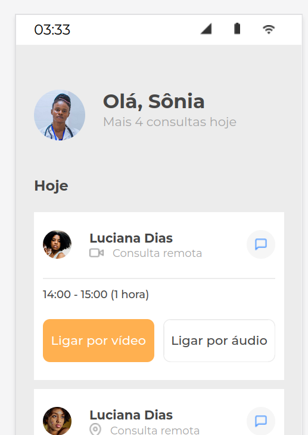

# Medical Clinic

This project is based on 7DaysOfCode is a Alura's challenge that was indicated to do at the end of the  "From zero: HTML e CSS to web projects" formation, this challenge is composed for the FirstMobile concept, so we start our application thinking on Mobile device and after that we change thinking in others devices.

1. Challenge First Day (July, 2nd)

Create the header and list of appoitments
